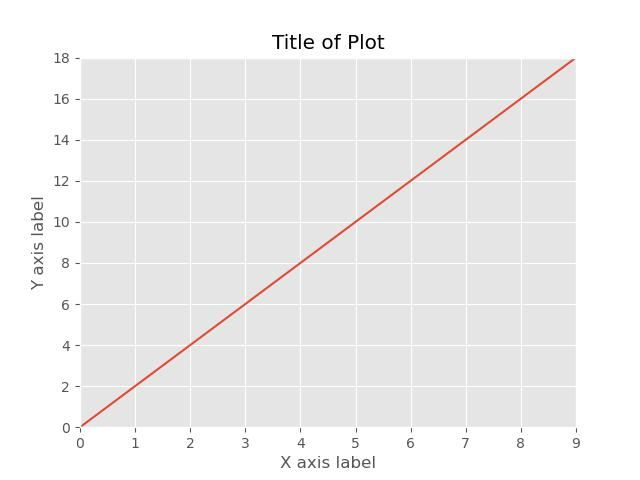
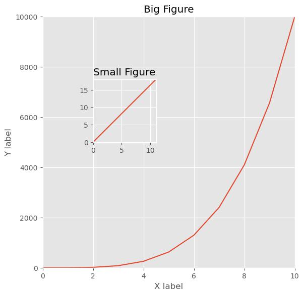
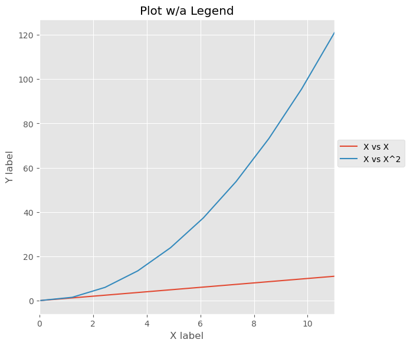
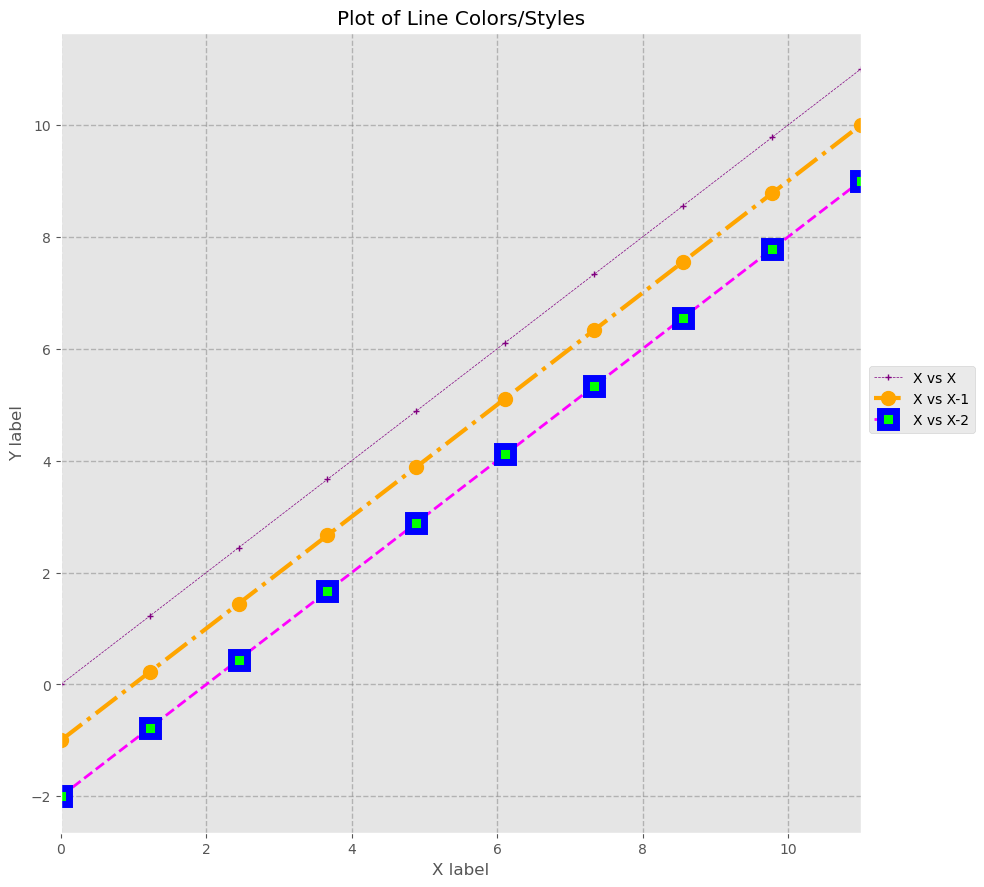
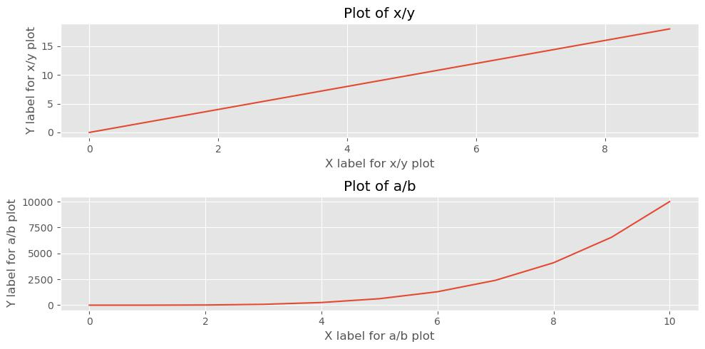

# Data Visualization <!-- omit in toc -->

---

# Table of Contents <!-- omit in toc -->

- [Matplotlib](#matplotlib)
  - [Graphing Attributes](#graphing-attributes)
  - [Graphing](#graphing)
    - [Legends](#legends)
    - [Line Color \& Styling](#line-color--styling)
    - [Subplot](#subplot)
- [Seaborn](#seaborn)
  - [Graphing Attributes](#graphing-attributes-1)
  - [Graphing](#graphing-1)
  - [Axes Grids](#axes-grids)
- [Bokeh](#bokeh)
  - [Graphing](#graphing-2)
  - [Modifier Commands](#modifier-commands)

## Matplotlib

|                           Command |                                                 |
| --------------------------------: | ----------------------------------------------- |
| `import matplotlib.pyplot as plt` | imports matplotlib.                             |
|              `%matplotlib inline` | added to jupyter notebooks to show in notebook. |
|             `plt.style.available` | displays all available graph styles.            |
|         `plt.style.use('ggplot')` | sets the graph style to be used in plotting.    |

### Graphing Attributes

|                         Command |                                                                      |
| ------------------------------: | -------------------------------------------------------------------- |
|  `plt.imread('image_file.png')` | loads an image and displays it                                       |
| `plt.savefig('image_file.png')` | saves an image in the specified filetype                             |
|       `plt.margins(buffer_pct)` | creates a **margin** around the figure to keep data off of the edges |
|            `plt.tight_layout()` | improves the **spacing** between subplots                            |
|               `plt.axis('off')` | removes the axes off the figure                                      |

### Graphing

Creates a basic line plot

```python
# creating data
x = np.arange(0, 10)
y = 2*x

plt.plot(x, y)

# lables for title and axes
plt.title("Title of Plot")
plt.xlabel("X axis label")
plt.ylabel("Y axis label")

# limits on the axes
plt.xlim(min(x), max(x))
plt.ylim(min(y), max(y))

plt.show()
```



Creates a figure object with axes added via ratios

```python
# creating data
x = np.arange(0, 10)
y = 2*x

a = np.linspace(0, 10, 11)
b = a**4

# figure object w/dpi setting and figsize
fig = plt.figure(figsize=(5,5), dpi=100)

# adding axes to figure object w/ratios
axes_1 = fig.add_axes([0, 0, 1, 1])
axes_1.plot(a, b)

# labels for the major axes
axes_1.set_title("Big Figure")
axes_1.set_xlabel("X label")
axes_1.set_ylabel("Y label")

# limits on axes_1
axes_1.set_xlim(min(a), max(a))
axes_1.set_ylim(min(b), max(b))

# adding axes to figure object w/ratios
axes_2  = fig.add_axes([0.2,0.5, 0.25, 0.25])
axes_2.plot(x, y)

# labels for the small axes
axes_2.set_title("Small Figure")

# limits on axes_2
axes_2.set_xlim(min(x), max(x))
axes_2.set_ylim(min(y), max(y))

# saving to file and showing plot
# plt.savefig("../data/images/sub-figure.jpg", bbox_inches="tight")
plt.show()
```



#### Legends

```python
# creating data
x = np.linspace(0, 11, 10)

# figure object w/dpi setting and figsize
fig = plt.figure(figsize=(5,5), dpi=100)

# adding axes to figure object w/ratios
ax = fig.add_axes([0,0,1,1])

ax.plot(x, x, label="X vs X")
ax.plot(x, x**2, label="X vs X^2")

# limits on axes
ax.set_xlim(min(x), max(x))

# labels for ax1
ax.set_title("Plot w/a Legend")
ax.set_xlabel("X label")
ax.set_ylabel("Y label")

# displays legend on figure w/best placement
# ax.legend(loc="best")

# displays legend off to the side of the figure
ax.legend(loc=(1.01, 0.5))

# saving file w/bounding box param to show axes
# plt.savefig("../data/images/legend_plot.png", bbox_inches="tight")
plt.show()
```



#### Line Color & Styling

```python
# creating data
x = np.linspace(0, 11, 10)

# figure object w/dpi setting and figsize
fig = plt.figure(figsize=(8, 8), dpi=100)

# adding axes to figure object w/ratios
ax = fig.add_axes([0,0,1,1])

# limits on axes
ax.set_xlim(min(x), max(x))

ax.plot(
    x, x, label="X vs X",
    # line parameters
    color="purple", lw=0.5, ls="--",
    # marker parameters
    marker='+', ms=5
)

ax.plot(
    x, x-1, label="X vs X-1",
    # line parameters
    color="orange", lw=3, ls="-.",
    # marker parameters
    marker="o", ms=10
)

ax.plot(
    x, x-2, label="X vs X-2",
    # line parameters
    color="magenta", lw=2, ls="--",
    # marker parameters
    marker="s", ms=12, markerfacecolor='lime',
    markeredgecolor="blue", markeredgewidth=5
)
# labels for ax1
ax.set_title("Plot of Line Colors/Styles")
ax.set_xlabel("X label")
ax.set_ylabel("Y label")

# grid for the figure
ax.grid(color='grey', alpha=0.5, linestyle='--', linewidth=1)

# displays legend off of the figure
ax.legend(loc=(1.01, 0.5))

# saving file w/bounding box param to show axes
# fig.savefig("../data/images/linestyles.png", bbox_inches="tight")
plt.show()
```



#### Subplot

Subplot with the axes contained as an `np.ndarray` accessed by element index.

```python
# creating data
x = np.arange(0, 10)
y = 2*x

a = np.linspace(0, 10, 11)
b = a**4

# figure object w/dpi setting and figsize and axes array
fig, axes = plt.subplots(figsize=(10,5), dpi=100, nrows=2, ncols=1)

# axes are now np.ndarray w/each axes as element
axes[0].plot(x,y)
axes[1].plot(a,b)

axes[0].set_title("Plot of x/y")
axes[0].set_xlabel("X label for x/y plot")
axes[0].set_ylabel("Y label for x/y plot")

axes[1].set_title("Plot of a/b")
axes[1].set_xlabel("X label for a/b plot")
axes[1].set_ylabel("Y label for a/b plot")

# prevents axes from overlapping
plt.tight_layout()

# saving to file and showing plot
# plt.savefig("../data/images/subplot-array.jpg", bbox_inches="tight")
plt.show()
```



## Seaborn

### Graphing Attributes

|               Command                |                                                                                 |
| :----------------------------------: | ------------------------------------------------------------------------------- |
|       `import seaborn as sns`        | imports seaborn.                                                                |
| `sns.despine(left=True, right=True)` | removes spines of the plot; add parameters of spines as needed                  |
|        `sns.color_palette()`         | returns the current color palette in use                                        |
|           `sns.palplot()`            | displays the color palettes in jupyter notebook                                 |
|       `sns.set_style('dark')`        | sets the default SEABORN theme (white/dark, whitegrid/darkgrid, ticks)          |
|     `sns.set(color_codes=True)`      | sets plots to use matplotlib color codes                                        |
|      `sns.set_palette(palette)`      | sets the SEABORN color palette (deep, muted, pastell, bright, dark, colorblind) |

### Graphing

plots a barplot, which provides the stats of a categorical column specified

```python
# provides a horizontal bar plot with the CATEGORICAL_COLUMN values on the y-axis; switch axes as needed
sns.barplot(x='Column_Name', y='Categorical_Column', data=df)

plt.show()
```

plots a **distplot**, which provides a histogram and kde density curve, as well as distribution with _rug=True_

```python
# creates a histogram with kde=False
sns.distplot( df['Column_Name'], kde=False, bins=int)

# creates a kde curve with hist=False
sns.distplot( df['Column_Name'], hist=False, bins=int)

# creates a rug plot with rug=True to view the distribution of data
sns.distplot( df['Column_Name'], rug=True, bins=int)

# uses the KEYWORDS_DICT to shade the area under the kde curve
sns.distplot( df['Column_Name'], kde_kws={ shade':True})

plt.show()

```

plots a **linear regression** graph

```python
# plots a single linear regression model fit to data specified
sns.regplot(x='Column_Name', y='Column_Name2', data=df)

# change the polynomial regression using the ORDER parameter
sns.regplot(x='Column_Name', y='Column_Name2', data=df, order=2)

plt.show()
```

plots a **residual plot**, useful for evaluating the fit of a model

```python
sns.residplot(x='Column_Name', y='Column_Name2', data=df, color='red')

# change the polynomial regression using the ORDER parameter
sns.residplot(x='Column_Name', y='Column_Name2', data=df, order=2)

plt.show()
```

**strip plot** plots the scatterplot of a categorical variable

```python
# using the 'x' parameter will provide a grouped strip plot
sns.stripplot(y='Column_Name', data=df)

# jitter spreads out split plot points (by size parameter) so they don't overlap
sns.stripplot(y='Column_Name', data=df, size=num, jitter=True)

plt.show()
```

**swarmplot** plots the scatterplot of a categorical variable; prevents points from overlapping

```python
sns.swarmplot(x='Column_Name', y='Column_Name2', data=df)

# 'hue' parameter displays the colors of a categorial column within the plot
sns.swarmplot(x='Column_Name', y='Column_Name2', data=df, hue='Column_Name3')

plt.show()
```

**boxplot** displays the minimum, maximum, and median values of a dataset along the 1st and 3rd quartiles and outliers

```python
sns.boxplot(x='Categorical Column', y='Column_Name2', data=df)

plt.show()
```

**KDE plots** show curved distributions

```python
sns.kdeplot(data_array)

plt.show()
```

**violinplots** show curved distributions (KDE) wrapped around a box plot

```python
# the distribution is denser where the violin plot is thicker
sns.violinplot(x='Column_Name', y='Column_Name2, data=df)

# inner=None will simplify the plot and remove data points

plt.show()
```

**lvplots** show a hybrid between a boxplot and violinplot and is relatively quick to render

```python
# the distribution is denser where the lvplot is thicker
sns.lvplot(x='Column_Name', y='Column_Name2', data=df)

plt.show()
```

**pairplots** provide jointplots for all possible pairs of numerical column variables in a df

```python
sns.pairplot(df)

plt.show()
```

**heatmaps** plot covariance matrices when pairplot() plots become visually overwhelming

```python
sns.heatmap(df.corr())

plt.show()
```

### Axes Grids

creates a **FacetGrid**, useful for plotting conditional relationships

```python

# creates a FacetGrid for ROW='Column Name';  specify the order of the rows using ROW_ORDER
fg = sns.FacetGrid(df,  row='Categorical Column', row_order=['Cat_Value_1', 'Cat_Value_2', 'Cat_Value_3'])
# use col, col_order to create FacetGrid COLUMN-WISE


# Map a BOXPLOT of specified column onto the grid; can map other PLOTS
fg.map(sns.boxplot, 'Column_Name')

# Show the plot
plt.show()
```

creates a **factorplot**, a simplier way to use a **FacetGrid** for categorical data

```python
# Create a FACTOR PLOT (simplier FacetGrid) that contains BOXPLOTS of the column specified
sns.factorplot(data=df, x='Column_Name', kind='box', row='Categorical Column')
# use col, col_order to create factorplot COLUMN-WISE

plt.show()
```

creates a **lmplot**, which is a **liner regression (regplot)** on a FacetGrid

```python
# data parameter is required, and x/y must be in string format
sns.lmplot(x='Column_Name', y='Column_Name2', data=df)

# 'order' parameter dictates higher order regressions
sns.lmplot(x='Column_Name', y='Column_Name2', data=df, order=2)

# 'hue' parameter groups subsets of data on the same plot
sns.lmplot(x='Column_Name', y='Column_Name2', data=df, hue='Categorical_Column')

# 'col' and 'row' parameters create subplots in the respective layout
sns.lmplot(x='Column_Name', y='Column_Name2', data=df, col='Categorical_Column')

plt.show()
```

creates a **PairGrid**, which shows pairwise relationships between data elements

```python
# creates a PAIRGRID comparing the VARS specified
g = sns.PairGrid( df,  vars=['ColumnName_1', 'Column_Name_2'])

# specifies the kind of PLOT in the diagonal / off-diagonal
g2 = g.map_diag(plt.hist)
g3 = g2.map_offdiag(plt.scatter)

plt.show()
```

creates a **pairplot**, a simplier way to use a **PairGrid**

```python
# creates a PAIRPLOT (simplier PairGrid) comparing the VARS specified
sns.pairplot(data=df,
        vars=['ColumnName_1', 'ColumnName_2'],
        kind='scatter',
        hue='Categorical_Column',
        palette='RdBu',					# other palettes are available
        diag_kws={'alpha':.5})		    # other KWs are available

plt.show()
```

creates a **JointGrid**, which combines **univariate** plots (histogram, kde, rug) with **bivariate** plots (scatter, regression)

```python
# create a JOINTGRID comparing the X/Y VALUES specified
g = sns.JointGrid(x='Column_Name', y='Column_Name2', data=df)

# MAIN-PLOT, MARGINAL-PLOT
g.plot(sns.regplot, sns.distplot)

plt.show()
```

creates a **jointplot**, a simplier way to use a **JointGrid**

```python
# creates a JOINTPLOT w/ a 2ND ORDER POLYNOMIAL REGRESSION
sns.jointplot(x='X_axis_column',
         y='Y_axis_column',
         kind='reg',            # other plots are available
         data=df,
         order=2)

# creates a JOINTPLOT w/ SCATTER and MARGINAL KDEPLOT
g = (sns.jointplot(x="temp",
             y="registered",
             kind='scatter',
             data=df,
             marginal_kws=dict(bins=10, rug=True)).plot_joint(sns.kdeplot))

plt.show()
```

## Bokeh

Visual properties of shapes are called glyphs in Bokeh. The visual properties of these glyphs such as position or color can be assigned single values (size=10, fill_color='red'). Other glyph properties can be set as lists or arrays (x=[1,2,3], size=[10,20,30]).

|                                           Command |                                                                                        |
| ------------------------------------------------: | -------------------------------------------------------------------------------------- |
|               `from bokeh.plotting import figure` | import `figure` to be able to create a figure object.                                  |
|       `from bokeh.models import ColumnDataSource` | import `ColumnDataSource` to be able to create a ColumnDataSource instance.            |
|              `from bokeh.models import HoverTool` | import `HoverTool` to be able to create a HoverTool instance.                          |
| `from bokeh.models import CategoricalColorMapper` | import `CategoricalColorMapper`to be able to create a CategoricalColorMapper instance. |
|              `from bokeh.layouts import gridplot` | import `gridplot` method to create rows and columns in one method.                     |
|                   `from bokeh.layouts import row` | import `row` method to place glyphs side by side.                                      |
|                `from bokeh.layouts import column` | import `column` method to place glyphs on top of one another.                          |
|    `from bokeh.models.widgets import Tabs, Panel` | import `Tabs` and `Panels` to create tabbed layouts.                                   |
|          `from bokeh.io import output_file, show` | plots can be saved to an html file.                                                    |
|      `from bokeh.io import output_notebook, show` | plots can be displayed inline in a jupyter notebook.                                   |

### Graphing

creates the **figure object** to be used; plot is commonly referenced as 'p'

```python
# can also use 'plot_height' parameter; can utilize other 'tool' objects (box_select, lasso_select, etc.)
plot = figure(plot_width=400, tools='pan, box_zoom')
```

**marker glyphs** determine the mark style used on the plot

```python
# can use other markers such as asterisk(), cross(), square(), triangle(), etc.
plot.circle(x, y)

# displays the plot in a browser(HTML) or inline a Jupyter Notebook
show(plot)
```

**line glyphs** plots a line through the coordinates specified

```python
# can use other parameters such as 'line_width'
 plot.line(x, y)

show(plot)
```

saves the plot to an **html file**

```python
output_file('file_name.html')
```

### Modifier Commands

creates a **ColumnDataSource instance** which defines data that can be used on multiple glyphs in a plot

```python
# source is created by passing a data dictonary through the ColumnDataSource initializer
# all columnns in the column data source instance must be the same length
source = ColumnDataSource( data={
    'x': [1,2,3,4,5],
    'y':[6,7,8,9,10]
})

# can also create a column data source instance using DataFrames
source = ColumnDataSource(df)
```

creates a **HoverTool instance** which defines the hover behavior of the plot

```python
hover = HoverTool(tooltips=None, mode='hline')

# passing the hover instance in the 'tool' parameter to be able to specify a hover policy in the 'plot' figure object
plot = figure(tools=[hover, 'crosshair'])

# if the plot has been defined, use the 'add_tools()' function to add more tools
p.add_tools(hover)

# a circle glyph with hover policies
plot.circle(x, y, hover_color='red', hover_size=10)
```

creates a **CategoricalColorMapper instance** which defines the colors to be mapped to the data

```python
mapper = CategoricalColorMapper(
    factors=['Data_Category_1', 'Data_Category_2', 'Data_Category_3'],
    palette=['red', 'green', 'blue']
)

# a circle glyph with color mapping policies by passing a 'color' dictionary
# the 'field' value should be the column containing the 'factors'
plot.circle(x, y, color={'field': 'Column_Name',
                         'transform':mapper})

# can also be formatted as follows
plot.circle(x, y, color=dict(field='origin', transform=mapper))
```
