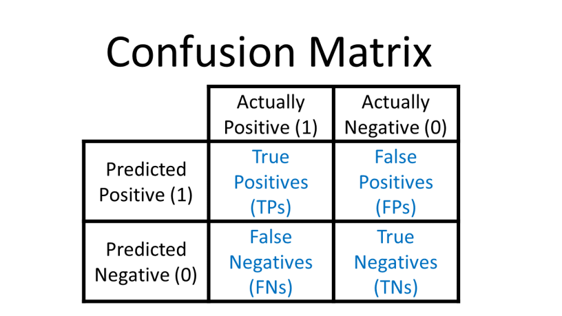

# Machine Learning <!-- omit in toc -->

---

# Table of Contents <!-- omit in toc -->

- [Terminology](#terminology)
- [General Definitions](#general-definitions)
  - [Bias Variance Trade-Off](#bias-variance-trade-off)
- [Pre-processing](#pre-processing)
  - [Train Test Split](#train-test-split)
  - [Feature Scaling](#feature-scaling)
    - [Standardization Scaling](#standardization-scaling)
    - [Normalization Scaling](#normalization-scaling)
    - [Scalers](#scalers)
  - [Cross Validation](#cross-validation)
  - [Imputers](#imputers)
  - [Encoding](#encoding)
    - [Integer Encoding](#integer-encoding)
    - [One-Hot Encoding](#one-hot-encoding)
- [Supervised Learning](#supervised-learning)
  - [Classification](#classification)
    - [K-Nearest Neighbors](#k-nearest-neighbors)
    - [Logistic Regression](#logistic-regression)
    - [Support Vector Machines (SVC)](#support-vector-machines-svc)
    - [LinearSVC](#linearsvc)
    - [Random Forests](#random-forests)
  - [Regression](#regression)
    - [Linear Regression](#linear-regression)
    - [Polynominal Regression](#polynominal-regression)
    - [Regularization](#regularization)
      - [Lasso - L1 Regularization](#lasso---l1-regularization)
      - [Ridge - L2 Regularization](#ridge---l2-regularization)
      - [Elastic Net - L1+L2 Regularization](#elastic-net---l1l2-regularization)
- [Unsupervised Learning](#unsupervised-learning)
  - [Classification](#classification-1)
    - [K Means Clustering](#k-means-clustering)
- [Feature Tuning](#feature-tuning)
  - [Confusion Matrix](#confusion-matrix)
  - [Classification Report](#classification-report)
  - [ROC (Receiver Operating Characteristic) Curve](#roc-receiver-operating-characteristic-curve)
  - [AUC (Area under ROC Curve)](#auc-area-under-roc-curve)
- [Hyperparameter Tuning](#hyperparameter-tuning)
  - [GridSearchCV (Grid Search Cross Validation)](#gridsearchcv-grid-search-cross-validation)
    - [RandomizedSearchCV (Randomized GridSearchCV)](#randomizedsearchcv-randomized-gridsearchcv)
  - [Pipelines](#pipelines)

# Terminology

| Symbol  | Meaning                        |
| :-----: | :----------------------------- |
| $\beta$ | model coefficient or parameter |

# General Definitions

|       Definition       | Meaning                                                                                     |
| :--------------------: | :------------------------------------------------------------------------------------------ |
|    Reducible Error     | error that can be improved upon by a statistical learning technique.                        |
|   Irreducible Error    | error that cannot be predicted and therefore cannot be reduced.                             |
| Quantitative Variables | variables that take on numerical on continuous values.                                      |
| Qualitative Variables  | variables that take on values in one of any number of different classes or categories.      |
|       Regression       | problems with a quantitative, or numerical response.                                        |
|     Classification     | problems with a qualitative, or classifying response.                                       |
|    Cross-Validation    | method for estimating the test mean squared error (MSE) using the training data.            |
|   Bootstrap Sampling   | sampling from the dataset with replacement.                                                 |
|   Hypothesis Testing   | statistical method used in making statistical decisions using experimental                  |
|    Null Hypothesis     | statement claiming that there is no relationship between X and Y(denoted by H<sub>0</sub>). |
| Alternative Hypothesis | statement directly contradicting the Null Hypothesis (denoted by H<sub>a</sub>).            |
|      Data Leakage      | Calculating statistics from full a dataset instead of just the training set.                |
|   Hold Out Test Set    | Test set not a part of cross-validation; utilized for hyperparameter tuning.                |

- `Accuracy` - the porportion of correct predictions made by a model over the total # of predictions.

  `# of correct predictions (TP + TN) / total # of predictions`

- `Missclassification (Error) Rate` - the porportion of incorrect predictions made by a model over the total # of predictions.

  `# of incorrect predictions (FP + FN) / total # of predictions`

- `Recall` - the ability of a model to find all the revelant cases within a dataset.

  `# of true positives (TP) / [# of true positives (TP) + # of false negatives (FN)]`

- `Precision` - the porportion of cases the models says was revelant and cases that were actually revelant.

  `# of true positives (TP) / [# of true positives (TP) + # of false positives (FP)]`

- `F1 Score` - the optimal blend of precision and recall to take into account both metrics. F1 provides the harmonic mean, which unlike the simple mean, punishes extreme values.

  `F1 = 2 (precision _ recall) / (precision + recall)`

## Bias Variance Trade-Off

Typically caused by model complexity in search for better performance.

**Overfitting**: when the model is fitting too much noise and variance in the training data. This means it will preform well on training data, but poorly on new unseen data. Overfitting is harder to detect, as good performance on training data could allude to the model performing well.

**Underfitting**: when the model doesn't capture the underlying trend of the data, and does not fit well enough to the training data. This is often a result of an excessively simple model.

- Low Bias / Low Variance - most accurate model
- Low Bias / High Variance - accurate predictions and more dispersed outliers
- High Bias / Low Variance - biased predictions and minimal outliers
- High Bias / High Variance biased predictions and more disperesed outliers

# Pre-processing

## Train Test Split

Split the data into separate train `(X_train, y_train)` and test `(X_test, y_test)` sets

```python
from sklearn.model_selection import train_test_split

# target values
y = df['Target_Column']

# feature values
X = df.drop('Target_Column', axis=1)

# splitting the data into train/test (70%/30%) sets
X_train, X_test, y_train, y_test = train_test_split(X, y, test_size = 0.3, random_state=42, stratify=True)

# test_size = % of test set, stratify = proportionate labels in each set
```

## Feature Scaling

- Improves the convergence of "steepest descent" algorithms, or machine learning models that rely on distance metrics.
- When features are on different scales, certain weights may update faster than others since the magnitude of feature values are considered in the weight updates.
- Allows for comparing measurements that have different units, and to directly compare model coefficients to each other.

> Caveats
>
> Feature scaling must always be done to new unseen data before providing it to the model. Feature scaling makes it easier to compare coefficients to one another, but harder to relate back to the original unscaled feature.

> Benefits
>
> While there is no "real" downside to scaling features, it is absolutely necessary for some models.

### Standardization Scaling

- Rescales data to have a mean of 0 and a standard deviation of 1.
- Sometimes referred to as "Z-score normalization".

### Normalization Scaling

- Rescales data values to be between 0 and 1.

### Scalers

Scale feature data using `scale` in `sklearn.preprocessing`

```python
from sklearn.preprocessing import scale

# feature values
X = df.drop('Target_Column', axis=1)

# scaled feature values
X_scaled = scale(X, axis=0)

# axis=0 standardizes each feature
# axis=1 standardizes each record
```

Scale data using `StandardScaler` transformer in `sklearn.preprocessing`

```python
from sklearn.preprocessing import StandardScaler

scaler = StandardScaler()

# fitting feature data using scaler
scaler.fit(X)

# each feature to have MEAN=0 and STD=1
StandardScaler(copy=True, with_mean=True, with_std=True)

# transform data for scaled feature values
samples_scaled = scaler.transform(X)
```

## Cross Validation

- Method that allows for training and evaluating all the data.
  - Create train/test splits leaving 1/K for test data.
  - Continue k number of splits to have all data evaluated and tested.
  - Average the errors to get the mean error (ie. expected performance).
- K-fold CV with K=10 is common; each test set is 10% of your total data.

> Caveats
>
> completing computations K number of times can be computationally expensive for large datasets.

> Benefits
>
> cross validation provides a better sense of true performance, across the multiple potental splits.

- scikit-learn uses a "scorer object" to provide metrics cross validation.
  - all scorer objects follow the convention that **higher** return values are **better** than lower return values.
  - because a high RMSE is not performant, a negative RMSE is used as its scorer metric

```python
from sklearn.model_selection import cross_val_score
from sklearn.linear_model import LinearRegression

# target values
y = df['Target_Column']

# feature values
X = df.drop('Target_Column', axis=1)

reg = LinearRegression()

# CROSS VALIDATING the model; cv= # of CROSS-VALIDATION folds
cv_results = cross_val_score(reg, X, y, cv=5)

# cv_results = array of CV scores (R-squared for LR)
```

## Imputers

Replace missing data using `Imputer` transformer in `sklearn.preprocessing`

```python
from sklearn.model_selection import train_test_split
from sklearn.preprocessing import Imputer

# feature values
X = df.drop('Target_Column', axis=1)

# axis=0 indicates columns, axis=1 indicates records
imp = Imputer(missing_values='NaN', strategy='most_frequent', axis=0)

# filling missing data using imputer
imp.fit(X)

# transform data for imputed feature values
X = imp.transform(X)
```

## Encoding

### Integer Encoding

Directly converts categories into integers (ie. 1, 2, 3,...,N)

> Caveats
>
> Encoding in this way implies an ordering and relationship for the category values and integers created; the
> machine learning algorithm may interpret these values as being on a linear scale (ordinal) and not categorical.

> Benefits
>
> Integer encoding is easy to understand and does not incease the number of features. Categorical values can be
> organized prior to encoding to allow the ordinal value scale to be applicable. (ie. mild, medium, hot...1,2,3)

### One-Hot Encoding

Converts categories into individual features that are either 0 or 1 (Dummy Variables). Can reduce feature column
expansion by creating higher level categories.

> Caveats
>
> Encoding this way increases the number of features (ie. a new feature created for each unique category value). Adding
> new category values could require more feature columns to be added

> Benefits
>
> One-Hot encoding does not imply an ordering and relationship for the categegory values and integers created;

# Supervised Learning

- Uses `historical` and `labeled` data; the machine learning model predicts a value.
  - Historical - known results and data from the past.
  - Labeled - the desired output is known.

## Classification

Machine learning models that calculate a categorical value; predicts an "assigned" category.

- Accuracy

  - great with balanced classes, but not great with unbalanced classes (ie. 100 images with 99 dog images, 1 cat image)

- Precision
  - measured by the ability of the model to identify only the relevant data points.

### K-Nearest Neighbors

- Classification algorithm that operates as:

  - calculates the distance from "x" to all points in the data
  - sorts the points by increasing distance from "x"
  - predicts the majority label of the "k" closest points

- Does not handle categorical data well

```python
from sklearn.model_selection import train_test_split
from sklearn.neighbors import KNeighborsClassifier

y = df['Target_Column']
X = df.drop('Target_Column', axis=1)
X_train, X_test, y_train, y_test = train_test_split(X, y, test_size = 0.3, random_state=42)

# defining n_neighbors for model
knn = KNeighborsClassifier(n_neighbors=6)

# fit the model to training data
knn.fit(X_train, y_train)

# predict the labels for the test data
pred = knn.predict(X_test)

# scoring the model accuracy with the train/test data
train_score = knn.score(X_train, y_train)
test_score = knn.score( X_test, y_test)
```

### Logistic Regression

- Logistic (Sigmoid) Function takes in any value and outputs it between 0 and 1.

```python
from sklearn.model_selection import train_test_split
from sklearn.linear_model import LogisticRegression

y = df['Target_Column']
X = df.drop('Target_Column', axis=1)
X_train, X_test, y_train, y_test = train_test_split(X, y, test_size = 0.3, random_state=42)

# instantiating a LOGISTIC_REGRESSION classifier
lr = LogisticRegression()

# fit the model to the training data
lr.fit(X_train, y_train)

# predict the labels for the test data
y_pred = lr.predict(X_test)

# scoring the model accuracy with the train/test data
train_score = lr.score(X_train, y_train)
test_score = lr.score(X_test, y_test)
```

### Support Vector Machines (SVC)

```python
from sklearn.model_selection import train_test_split
from sklearn.svm import SVC

y = df['Target_Column']
X = df.drop('Target_Column', axis=1)
X_train, X_test, y_train, y_test = train_test_split(X, y, test_size = 0.3, random_state=42)

svm = SVC()

# fit the model to the training data
svm.fit(X_train, y_train)

# predict the labels for the test data
pred = svm.predict(X_test)

# scoring the model accuracy with the train/test data
train_score = svm.score(X_train, y_train)
test_score = svm.score(X_test, y_test)
```

### LinearSVC

```python
from sklearn.model_selection import train_test_split
from sklearn.svm import LinearSVC

y = df['Target_Column']
X = df.drop('Target_Column', axis=1)
X_train, X_test, y_train, y_test = train_test_split(X, y, test_size = 0.3, random_state=42)

svm = LinearSVC()

# fit the model to the training data
svm.fit(X_train, y_train)

# predict the labels for the test data
pred = svm.predict(X_test)

# scoring the model accuracy with the train/test data
train_score = svm.score(X_train, y_train)
test_score = svm.score(X_test, y_test)
```

### Random Forests

Uses many trees with a random sample of features chosen as the split. Alleviates one very strong feature from creating an ensemble of highly similar trees that use the strong feature at the top split.

- a new random sample of features is chosen for every single tree, at every single split.
- in a classification random forest model, `m` features is typically chosen to be the `sqrt(p)` or square root of the `p` full set of features.

## Regression

- Machine learning models that calculates a continuous value; predicts a continuous value like prices, scores, etc.

|          Definition           | Meaning                                                                                                                                                                           |
| :---------------------------: | :-------------------------------------------------------------------------------------------------------------------------------------------------------------------------------- |
|   Mean Absolute Error (MAE)   | the average of the absolute value of errors `ie. true value - predicted value`; does not punish large errors.                                                                     |
|   Mean Squared Error (MSE)    | the average of the absolute value of errors squared `ie. (true value - predicted_value)^2`; punishes large errors but is in squared units.                                        |
| Root Mean Square Error (RMSE) | the square root of the average of the value of errors squared `ie. sqrt(true_value - predicted value)^2`; punishes large errors and provides the same units as y.                 |
| Ordinary Least Squares (OLS)  | minimizing the sum of the squares of differences between the observed dependent variable, and the variable predicted by the linear function. `ie. y=mx+b`                         |
|           Residual            | the difference between the actual observed response and the predicted response.                                                                                                   |
| RSS (Residual Sum of Squares) | sum of the differences between the observed response and the predicted resonse.                                                                                                   |
|  Population Regression Line   | the best linear approximation to the true relationship between X and Y.                                                                                                           |
|      Confidence Interval      | computed at a designated "confidence level" (ie. 95th, 99th) provides the range of estimates for an unknown parameter.                                                            |
|        Hypothesis Test        | method of statistical inference to decide if the data supports a particular hypothesis (ie. null, alternative)                                                                    |
|        Null Hypothesis        | the claim that no relationship exists between X and Y.                                                                                                                            |
|    Alternative Hypothesis     | the claim that a relationship exists between X and Y.                                                                                                                             |
|          t-statistic          | the ratio of the departure of the estimated value of a parameter ($\beta$) from its hypothesized value to its standard error.                                                     |
|            p-value            | probability of obtaining test results as extreme as the result actually observed, under the assumption the null hypothesis is correct. Small p-values reject the null hypothesis. |
|        Standard Error         | the average amount that the sample mean differs from the actual population mean.                                                                                                  |
| RSE (Residual Standard Error) | average amount that the response will deviate from the true regression line; measures the lack of fit of the model.                                                               |

### Linear Regression

Useful tool for predicting a quantitative response, and a good jumping-off point for newer approaches.

- OLS Theory
  - allows the solving for slope m and intercept b

```python
from sklearn.model_selection import train_test_split
from sklearn.linear_model import LinearRegression

y = df['Target_Column']
X = df.drop('Target_Column', axis=1)
X_train, X_test, y_train, y_test = train_test_split(X, y, test_size = 0.3, random_state=42)

reg = LinearRegression()

# fit the model to the training data
reg.fit(X_train, y_train)

# predict the labels for the test data
y_pred = reg.predict(X_test)

# scoring the model accuracy with the train/test data
train_score = reg.score(X_train, y_train)
test_score = reg.score(X_test, y_test)
```

### Polynominal Regression

This type of regression model considers higher order relationships on the features; it addresses two issues not addressed with linear regression:

- Non-linear feature relationships to labels.
- Interaction terms between features.

**Interaction terms** applies to features that are only significant when in "sync" with another feature. An interaction term is a feature created by multipling the two exisitng features together; it is then incorporated along with the original features and provided to the regression model.

**PolynominalFeatures** scikitlearn preprocessing library will automatically create both higher order feature polynominals and the interaction terms between all feature combinations.

### Regularization

A method to reduce model fitting and variance by adding more bias. Solves these model issues by:

- minimizing model complexity
- penalizing the loss function
- reducing model overfitting
- searching for an optimal penalty hyperparameter.

> Caveats
>
> introducing an additional hyperparameter means it needs to also be tuned; a multiplier is added to the penalty to decide the "strength" of the penalty.

#### Lasso - L1 Regularization

Resources:

- [Lasso - Wikipedia](<https://en.wikipedia.org/wiki/Lasso_(statistics)>)
- [Lasso - scikit-learn](https://scikit-learn.org/stable/modules/generated/sklearn.linear_model.Lasso.html)
- [LassoCV - scikit-learn](https://scikit-learn.org/stable/modules/generated/sklearn.linear_model.LassoCV.html#sklearn.linear_model.LassoCV)

LASSO (Least Absolute Shrinkage and Selection Operator) Regularization adds a penalty greater than or equal to the **absolute value** of the magnitude of coefficients $\beta$. This helps to limit the size of coefficients, and can yield sparse models where some coefficients can become zero.

When tuning parameter $\lambda$ is sufficiently large, coefficient estimates can be forced to equal zero; this results in the Lasso model performing variable selection.

> Benefits
>
> Generally much easier to interpret than Ridge.

```python
import numpy as np
from sklearn.metrics import mean_absolute_error, mean_squared_error
from sklearn.model_selection import train_test_split
from sklearn.linear_model import Lasso

y = df['Target_Column']
X = df.drop('Target_Column', axis=1)
X_train, X_test, y_train, y_test = train_test_split(X, y, test_size = 0.3, random_state=42)

# normalize=True normalizes all variables
lasso = Lasso(alpha=0.1, normalize=True)

# fit the model to the training data
lasso.fit(X_train, y_train)

# predicting the labels for the test data
test_predictions = ridge.predict(X_test)

# scoring the model accuracy with the train/test data
train_score = lasso.score(X_train, y_train)
test_score = lasso.score(X_test, y_test)

# calculating the mean absolute and root mean squared errors
MAE = mean_absolute_error(y_test, test_predictions)
RMSE = np.sqrt(mean_squared_error(y_test, test_predictions))

print(f"MAE: {MAE}")
print(f"RMSE: {RMSE}")
```

Lasso Regression with built-in cross validation.

```python
import numpy as np
from sklearn.metrics import mean_absolute_error, mean_squared_error
from sklearn.model_selection import train_test_split
from sklearn.linear_model import LassoCV

lasso_cv_model = LassoCV(
    # ratio of alpha_min to alpha_max
    eps=0.001,
    # number of alphas
    n_alphas=100,
    # number of iterations for convergence
    max_iter=10000,
    # number of folds to create
    cv=10
)
lasso_cv_model.fit(X_train, y_train)

# identifies the best performing alpha value
print(f"Best Performing ALPHA: {round(lasso_cv_model.alpha_, 3)}\n")

# predicting the labels for the test data
test_predictions = lasso_cv_model.predict(X_test)

# calculating the mean absolute and root mean squared errors
MAE = mean_absolute_error(y_test, test_predictions)
RMSE = np.sqrt(mean_squared_error(y_test, test_predictions))

print(f"MAE:  {round(MAE, 4)}")
print(f"RMSE: {round(RMSE, 4)}")

```

#### Ridge - L2 Regularization

Resources:

- [Ridge - scikit-learn](https://scikit-learn.org/stable/modules/generated/sklearn.linear_model.Ridge.html#sklearn.linear_model.Ridge)
- [RidgeCV - scikit-learn](https://scikit-learn.org/stable/modules/generated/sklearn.linear_model.RidgeCV.html#sklearn.linear_model.RidgeCV)

Regularization that adds a penalty greater than or equal to the **square** of the magnitude of coefficients.This helps to limit the size of coefficients, as all coefficients are shrunk by the same factor; however this does not necessarily eliminate coefficients.

```python
import numpy as np
from sklearn.metrics import mean_absolute_error, mean_squared_error
from sklearn.model_selection import train_test_split
from sklearn.linear_model import Ridge

y = df['Target_Column']
X = df.drop('Target_Column', axis=1)
X_train, X_test, y_train, y_test = train_test_split(X, y, test_size = 0.3, random_state=42)

# normalize=True normalizes all variables
ridge = Ridge(alpha=0.1, normalize=True)

# fit the model to the training data
ridge.fit(X_train, y_train)

# predicting the labels for the test data
test_predictions = ridge.predict(X_test)

# scoring the model accuracy with the train/test data
train_score = ridge.score(X_train, y_train)
test_score = ridge.score(X_test, y_test)

# calculating the mean absolute and root mean squared errors
MAE = mean_absolute_error(y_test, test_predictions)
RMSE = np.sqrt(mean_squared_error(y_test, test_predictions))

print(f"MAE: {MAE}")
print(f"RMSE: {RMSE}")
```

Ridge Regression with built-in cross validation.

```python
import numpy as np
from sklearn.metrics import mean_absolute_error, mean_squared_error, SCORERS
from sklearn.model_selection import train_test_split
from sklearn.linear_model import RidgeCV

# instance of ridge model w/cross validation
ridge_cv_model = RidgeCV(
    # alpha parameters to test
    alphas=(0.1, 1.0, 10.0),
    # identifies the number of folds to create; none = leave-one-out cv
    cv=None,
    # tells which scoring error to use
    scoring="neg_mean_absolute_error"
)

ridge_cv_model.fit(X_train, y_train)

# identifies the best performing alpha
print(f"Best Performing ALPHA: {round(ridge_cv_model.alpha_, 3)}\n")

# predicting the labels for the test data
test_predictions = ridge_cv_model.predict(X_test)

# calculating the mean absolute and root mean squared errors
MAE = mean_absolute_error(y_test, test_predictions)
RMSE = np.sqrt(mean_squared_error(y_test, test_predictions))

print(f"MAE:  {round(MAE, 4)}")
print(f"RMSE: {round(RMSE, 4)}")
```

#### Elastic Net - L1+L2 Regularization

Resources:

- [ElasticNet - scikit-learn](https://scikit-learn.org/stable/modules/generated/sklearn.linear_model.ElasticNet.html#sklearn.linear_model.ElasticNet)
- [ElasticNetCV - scikit-learn](https://scikit-learn.org/stable/modules/generated/sklearn.linear_model.ElasticNetCV.html#sklearn.linear_model.ElasticNetCV)

Combines **L1** and **L2** with the addition of an aplha parameter determining the ratio between them.

```python
import numpy as np
from sklearn.metrics import mean_absolute_error, mean_squared_error
from sklearn.model_selection import train_test_split
from sklearn.linear_model import ElasticNetCV

y = df['Target_Column']
X = df.drop('Target_Column', axis=1)
X_train, X_test, y_train, y_test = train_test_split(X, y, test_size = 0.3, random_state=42)

elastic_cv_model = ElasticNetCV(
    # ratio for L1 (lasso) to L2 (ridge) scaling
    l1_ratio=[.1, .5, .9, .95, .99, 1],
    # ratio of alpha_min to alpha_max
    eps=0.001,
    # number of alphas
    n_alphas=100,
    # number of iterations for convergence
    max_iter=1000000,
)

elastic_cv_model.fit(X_train, y_train)

# identifies the best performing L1 to L2 ratio
print(f"Attempted L1 Ratios: {elastic_cv_model.l1_ratio}")
print(f"Best L1 Ratio: {elastic_cv_model.l1_ratio_}\n")

# identifies the best performing alpha value
print(f"Best Performing ALPHA: {round(elastic_cv_model.alpha_, 3)}\n")

# predicting the labels for the test data
test_predictions = elastic_cv_model.predict(X_test)

# calculating the mean absolute and root mean squared errors
MAE = mean_absolute_error(y_test, test_predictions)
RMSE = np.sqrt(mean_squared_error(y_test, test_predictions))

print(f"MAE:  {round(MAE, 4)}")
print(f"RMSE: {round(RMSE, 4)}")

```

# Unsupervised Learning

- Uses unlabeled data; the machine learning model discovers possible patterns in the data.
  - clusters population into separate groups based off their behavior features.
- No historical correct label, hard to evaluate performance of an unsupervised algorithm.

## Classification

### K Means Clustering

- Goal is to divide data into similarly distinct groups, defined by number of clusters `k`.

- Process is to **randomly assign** each point in the data to a cluster.
- Until clusters stop changing:

  - for each cluster, compute the "cluster centroid" by taking the mean vector of points in the cluster.
  - assign each data point to the cluster for which the centroid is the closest.

- With no best way to choose `k` value, `elbow method` is found to be sufficient.

  - compute the SSE for some values of k (ie. 2, 4, 6, 8).
  - when plotting `k` against the SSE, the error decreases as `k` gets larger because the number of clusters increases (distortion in a cluster is also smaller).
    - this observation creates an "elbow effect" when SSE decreases abruptly; the `k` value at the elbow is chosen.

  > **SSE (Sum of Squared Error):** the sum of the squared distance between each member of the cluster and its centroid.

```python
from sklearn.cluster import KMeans

X = df

# n_clusters tell model how many clusters to create
kmeans = KMeans(n_clusters=2)

# fit the model to the data
kmeans.fit(X)

# provides the centers of n_clusters
cluster_centers = kmeans.cluster_centers_

# gives the predicted labels
predictions = kmeans.labels_
```

# Feature Tuning

## Confusion Matrix

<p align="center">

</p>

Fundamentally a Confusion Matrix provides ways to compare predicted values versus true values.

- **True Positive (TP)** - model predicts positive, outcome is positive
- **False Positive (FP) Type I Error** - model predicts positive, outcome is negative
- **True Negative (TN)** - model predicts negative, outcome is negative
- **False Negative (FN) Type II Error** - model predicts negative, outcome is positive

Using a **K-Nearest Neighbors** Model:

```python
from sklearn.model_selection import train_test_split
from sklearn.neighbors import KNeighborsClassifier
from sklearn.metrics import confusion_matrix

y = df['Target_Column']
X = df.drop('Target_Column', axis=1)
X_train, X_test, y_train, y_test = train_test_split(X, y, test_size = 0.3, random_state=42)

# defining n_neighbors for the model
knn = KNeighborsClassifier(n_neighbors=6)

# fit the model to the training data
knn.fit(X_train, y_train)

# predict the labels for the test data
y_pred = knn.predict(X_test)

# generate the confusion_matrix on actual/predicted labels
confusion_m = confusion_matrix(y_test, y_pred)

# print confusion_m = [[TP, FN], [FP,TN]]
print(confusion_m)
```

## Classification Report

Using a **K-Nearest Neighbors** Model:

```python
from sklearn.model_selection import train_test_split
from sklearn.neighbors import KNeighborsClassifier
from sklearn.metrics import classification_report

y = df['Target_Column']
X = df.drop('Target_Column', axis=1)
X_train, X_test, y_train, y_test = train_test_split(X, y, test_size = 0.3, random_state=42)

# defining n_neighbors for the model
knn = KNeighborsClassifier(n_neighbors=6)

# fit the model to the training data
knn.fit(X_train, y_train)

# predict the labels for the test data
y_pred = knn.predict(X_test)

# generate the classification report on actual/predicted labels
classification_r = classification_report(y_test, y_pred)

# SUPPORT column provides # of samples of the TRUE RESPONSE that lie in that class
print(classification_report(y_test, y_pred))

'''
SPAM E-MAIL EXAMPLE:
HIGH PRECISION = not many emails predicted as spam
HIGH RECALL = predicted most spam emails correctly
'''
```

## ROC (Receiver Operating Characteristic) Curve

```python
from sklearn.model_selection import train_test_split
from sklearn.metrics import roc_curve

y = df['Target_Column']
X = df.drop('Target_Column', axis=1)
X_train, X_test, y_train, y_test = train_test_split(X, y, test_size = 0.3, random_state=42)

lr = LogisticRegression()

# predict_proba gives probabilities w/out threshold; [:,1] are labels for the '1' binary label
y_pred_prob = lr.predict_proba(X_test)[:,1]

# unpack ROC curve values: fpr, tpr, thresholds
fpr, tpr, thresholds = roc_curve(y_test, y_pred_prob)

'''
fpr = FALSE POSITIVE RATE
tpr = TRUE POSITIVE RATE
'''
```

## AUC (Area under ROC Curve)

- Large AUC = better model; produces one AUC Score.

```python
from sklearn.model_selection import train_test_split
from sklearn.metrics import roc_auc_score

y = df['Target_Column']
X = df.drop('Target_Column', axis=1)
X_train, X_test, y_train, y_test = train_test_split(X, y, test_size = 0.3, random_state=42)

lr = LogisticRegression()

# fit the model to the training data
lr.fit(X_train, y_train)

# predict_proba gives probabilities w/out threshold; [:,1] are labels for the '1' binary label
y_pred_prob = lr.predict_proba(X_test)[:,1]

# compute the ROC_AUC_SCORE
score = roc_auc_score(y_test, y_pred_prob)
```

Using `cross_val_score` from `sklearn.model_selection` (Cross Validation); produces multiple AUC Scores

```python
from sklearn.model_selection import cross_val_score


y = df['Target_Column']
X = df.drop('Target_Column', axis=1)

# instantiating a LOGISTIC_REGRESSION classifier
lr = LogisticRegression()

# CROSS_VALIDATING the model; scoring='roc_auc' provides AUC (Area Under ROC Curve) Scores
cv_results = cross_val_score(lr, X, y, cv=5, scoring='roc_auc')

# compute the average ROC_AUC_SCORE
mean_score = np.mean(cv_results)
```

# Hyperparameter Tuning

## GridSearchCV (Grid Search Cross Validation)

```python
from sklearn.model_selection import train_test_split
from sklearn.linear_model import LogisticRegression
from sklearn.model_selection import GridSearchCV

y = df['Target_Column']
X = df.drop('Target_Column', axis=1)
X_train, X_test, y_train, y_test = train_test_split(X, y, test_size = 0.3, random_state=42)

# setup HYPERPARAMETER_GRID for model hyperparameter(s)
param_grid = {'C': np.arange(0, 10, 1)}

lr = LogisticRegression()

# intantiating the gridsearch object
lr_cv = GridSearchCV(lr, param_grid, cv=5)

# fit the model to the training data
lr_cv.fit(X_train, y_train)

# returns a dict of the best performing features and values
best_p = lr_cv.best_params_

# returns the score of the best performing feature
best_score = lr_cv.best_score_
```

```python
from sklearn.model_selection import train_test_split
from sklearn.neighbors import KNeighborsClassifier
from sklearn.model_selection import GridSearchCV

y = df['Target_Column']
X = df.drop('Target_Column', axis=1)
X_train, X_test, y_train, y_test = train_test_split(X, y, test_size = 0.3, random_state=42)

# setup HYPERPARAMETER_GRID for model hyperparameter(s)
param_grid = {'n_neighbors': np.arange(1, 50)}

knn = KNeighborsClassifier()

# intantiating the gridsearch object
knn_cv = GridSearchCV(knn, param_grid, cv=5)

# fit the model to the training data
knn_cv.fit(X_train, y_train)

# returns a dict of the best performing features and values
best_p = knn_cv.best_params_

# returns the score of the best performing feature
best_score = knn_cv.best_score_
```

```python
from sklearn.model_selection import train_test_split, GridSearchCV
from sklearn.metrics import mean_squared_error
from sklearn.linear_model import ElasticNet

y = df['Target_Column']
X = df.drop('Target_Column', axis=1)
X_train, X_test, y_train, y_test = train_test_split(X, y, test_size = 0.3, random_state=42)

# setup HYPERPARAMETER_GRID for model hyperparameter(s)
param_grid = {'l1_ratio': np.linspace(0, 1, 30)}

elastic_net = ElasticNet()

# instantiating the gridsearch object
gm_cv = GridSearchCV(elastic_net, param_grid, cv=5)

# fit the model to the training data
gm_cv.fit(X_train, y_train)

# predict the labels for the test data
y_pred = gm_cv.predict(X_test)

# scoring the elastic_net model (REGRESSOR)
r2 = gm_cv.score(X_test, y_test)

# computing the mean_squared_error using actual/predicted labels
mse = mean_squared_error(y_test, y_pred)

# returns a dict of the best performing features and values
best_p = gm_cv.best_params_

# returns the score of the best performing feature
best_score = gm_cv.best_score_

print("Tuned ElasticNet R squared: {}".format(r2))
print("Tuned ElasticNet MSE: {}".format(mse))
```

### RandomizedSearchCV (Randomized GridSearchCV)

Not as computationally expensive as `GridSearchCV`

```python
from sklearn.model_selection import train_test_split
from scipy.stats import randint
from sklearn.tree import DecisionTreeClassifier
from sklearn.model_selection import RandomizedSearchCV

y = df['Target_Column']
X = df.drop('Target_Column', axis=1)
X_train, X_test, y_train, y_test = train_test_split(X, y, test_size = 0.3, random_state=42)

# setup HYPERPARAMETER_GRID for model hyperparameter(s)
param_dist = {"max_depth": [3, None], "max_features": randint(1, 9),
              "min_samples_leaf": randint(1, 9), "criterion": ["gini", "entropy"]}

tree = DecisionTreeClassifier()

# instantiating the gridsearch object
tree_cv = RandomizedSearchCV(tree, param_dist, cv=5)

# fit the model to the training data
tree_cv.fit(X_train, y_train)

# returns a dict of the best performing features and values
best_p = tree_cv.best_params_

# returns the score of the best performing feature
best_score = tree_cv.best_score_
```

## Pipelines

Using `K-Nearest Neighbors` Model; scaling data using `StandardScaler` and comparing scaled/un-scaled scores.

```python
from sklearn.model_selection import train_test_split
from sklearn.preprocessing import StandardScaler
from sklearn.neighbors import KNeighborsClassifier
from sklearn.pipeline import Pipeline

y = df['Target_Column']
X = df.drop('Target_Column', axis=1)
X_train, X_test, y_train, y_test = train_test_split(X, y, test_size = 0.3, random_state=42)

# setup steps with transformer and estimator
steps = [('scaler', StandardScaler()),
        ('knn', KNeighborsClassifier())]

# instantiating pipeline
pipeline = Pipeline(steps)

# fit the pipeline, computes 'scaler' then 'knn'
knn_scaled = pipeline.fit(X_train, y_train)

# fitting unscaled training data for comparison
knn_unscaled = KNeighborsClassifier().fit(X_train, y_train)

# scoring the model accuracy with the scaled/un-scaled test data
scaled_score = knn_scaled.score(X_test, y_test)
unscaled_score = knn_unscaled.score(X_test, y_test)
```

Using `SVC (Support Vector Machine)` Model; producing `Classification Report` on predictions after cleaning up missing data

```python
from sklearn.model_selection import train_test_split
from sklearn.preprocessing import Imputer
from sklearn.svm import SVC
from sklearn.metrics import classification_report
from sklearn.pipeline import Pipeline

y = df['Target_Column']
X = df.drop('Target_Column', axis=1)
X_train, X_test, y_train, y_test = train_test_split(X, y, test_size = 0.3, random_state=42)

imp = Imputer(missing_values='NaN', strategy='most_frequent', axis=0)

# setup steps with transformer and estimator
steps = [('imputation', imp), ('SVM', SVC())]

# instantiating pipeline
pipeline = Pipeline(steps)

# fit the pipeline, computes 'imputation' then 'SVM'
pipeline.fit(X_train, y_train)

# predict the labels for the test data
y_pred = pipeline.predict(X_test)

# generate the classification report on actual/predicted labels
classification_r = classification_report(y_test, y_pred)

# support column provides # of samples of the TRUE RESPONSE that lie in that class
print(classification_report(y_test, y_pred))
```
